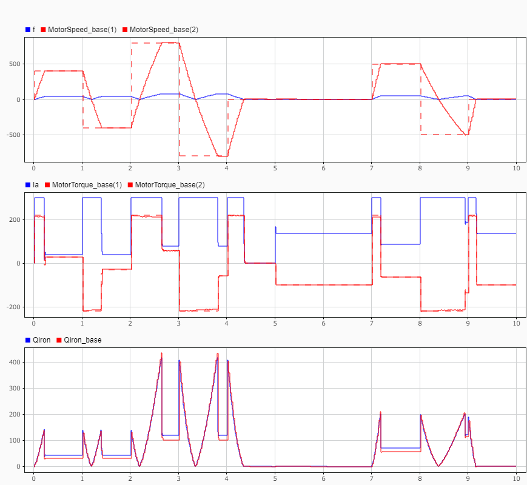

# PMSM wire temperature estimation using Extended Kalman Filter

This repository is to estimate wire temperature of PMSM by Extended Kalman Filter (EKF).

## Base model


The base model (to be estimated) is an example provided by MathWorks.

- [FEM-Parameterized PMSM](https://jp.mathworks.com/help/sps/ref/femparameterizedpmsm.html)
- [PMSM with Thermal Model - MathWorks](https://jp.mathworks.com/help/sps/ug/pmsm-with-thermal-model.html)

All phisical parameters are kept as default value.

This model is partially black boxed, however is equivalent to the following model.

### Equivalent model


The heat generation of the base model PMSM is equivalent to the above.

- The heat capacity of the wires is modeled as thermal mass for each wire.
- Copper loss is modeled as resistor with thermal port for each wire.
- Iron loss (defined as heat flux) is distributed into the rotor part and the wire part.

## Models used for estimation

### Iron loss

In the base model, the iron loss $`Q_{iron} \mathrm{[W]}`$ is modeled as:

```math
\begin{aligned}
P_{OC} &= \frac{a_h}{k} V_{m_{rms}}(f(t),i_d(t),i_q(t))
+ \frac{a_J}{k^2} V_{m_{rms}}^2(f(t),i_d(t),i_q(t))
+ \frac{a_{ex}}{k^{1.5}} V_{m_{rms}}^{1.5}(f(t),i_d(t),i_q(t)) \\

P_{SC} &= \frac{b_h}{k} V_{d_{rms}}(f(t),i_d(t))
+ \frac{b_J}{k^2} V_{d_{rms}}^2(f(t),i_d(t))
+ \frac{b_{ex}}{k^{1.5}} V_{d_{rms}}^{1.5}(f(t),i_d(t))
\end{aligned}
```

```math
Q_{iron}(f(t),i_d(t),i_q(t)) = P_{OC} + P_{SC}
```

where, $`f \mathrm{[Hz]}`$ is electrical frequency, $`V_{m_{rms}}, V_{d_{rms}} \mathrm{[V]}`$ are back EMF, $`k \mathrm{[Vs/m]}`$ is back EMF constant, and $`i_d, i_q \mathrm{[A]}`$ are d-axis and q-axis currents, respectively.

$`a_h, a_J, a_{ex}, b_h, b_J, b_{ex}`$ are parameters identifying the iron loss.

In the models described below, the iron loss is simplified as:

```math
Q_{iron}(f(t),i_{all}(t)) = c_h |f(t) i_{all}(t)| + c_J |f(t) i_{all}(t)|^2 + c_{ex} |f(t) i_{all}(t)|^{1.5}
```

where,

```math
i_{all}(t) = \sqrt{i_d^2(t) + i_q^2(t)},
```

$`f \mathrm{[Hz]}`$ is electrical frequency, $`c_h, c_J, c_{ex}`$ are parameters.

### DC model (low frequency)


Since the three phase current $`i_a, i_b, i_c`$ (usually high frequency) are used to calculate copper loss in the base model, the simulation also requires a high sampling frequency.

To mitigate this, the following model with equivalent DC $`i_{all}`$ calculated from $`i_d`$ and $`i_q`$ is used in the simulation.

- Temperatures of every wires are same.
- Thermal mass and thermal resistance (including convection and conduction) of the wire is the sum of all wires.
- Copper loss is modeled as a single resistor with thermal port.
- Iron loss $`Q_{iron}`$ is calculated by the simplified model and distributed into the rotor part $`Q_{rotor}`$ and the wire part $`Q_{wire}`$ with ratio $`r`$.

```math
\begin{aligned}
Q_{rotor} &= r Q_{iron} \\
Q_{wire} &= (1 - r) Q_{iron}
\end{aligned}
```

It is obvious that this model ignores temperature differences between wires.

Therefore, the stall condition (torque is applied but speed is zero) could result in a large error from the actual temperature.

### Three phase AC model (low frequency)


## Model verification




## Estimation


