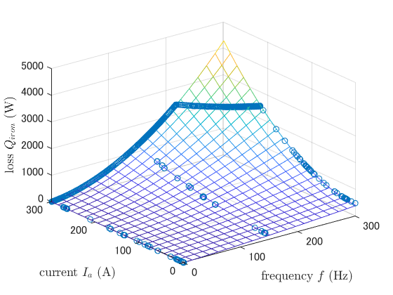
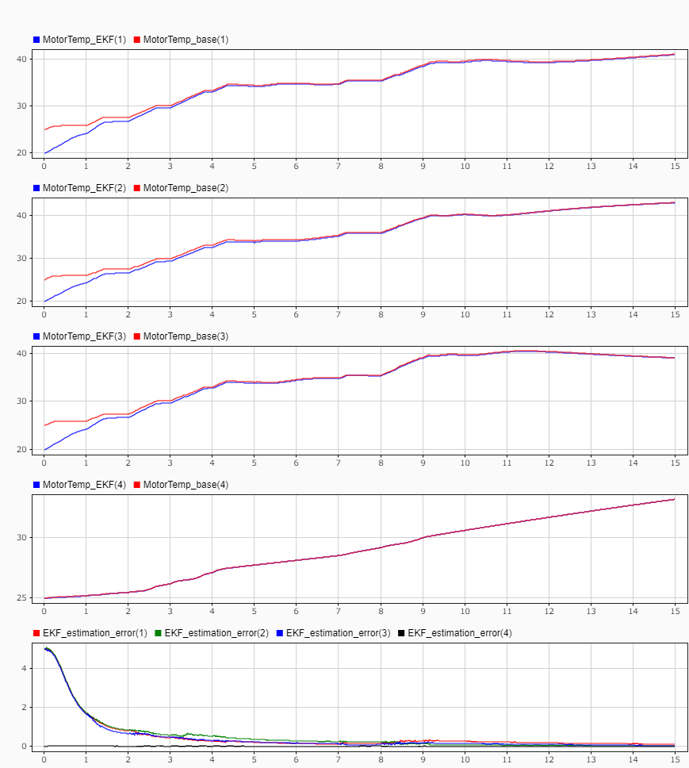

# PMSM wire temperature estimation using Extended Kalman Filter

This repository is to estimate wire temperature of PMSM by Extended Kalman Filter (EKF).

## Usage and requirements

- MATLAB
- Simulink
- Control System Toolbox
- Curve Fitting Toolbox
- Symbolic Math Toolbox
- Simscape
- Simscape Electrical

1. Open MATLAB project *PMSM_temperature_estimation_EKF.prj*.
1. Run *config.m*.
1. Run *identify_iron_loss.mlx* if iron loss needs to be identified.
    1. Run the script.
    1. Copy parameters into *controller_parameters.m*.
1. Run *derivate_state_equation.mlx* if the state space model is to be updated.
1. Run the simulink model *PMSM_temperature_estimation_EKF.slx*.

## Base system


The base system (to be estimated) is an example provided by MathWorks.

- [FEM-Parameterized PMSM](https://jp.mathworks.com/help/sps/ref/femparameterizedpmsm.html)
- [PMSM with Thermal Model - MathWorks](https://jp.mathworks.com/help/sps/ug/pmsm-with-thermal-model.html)

The iron loss parameters are set to `losses_oc = [50,30,10]`, `losses_sc = [30,20,10]`, and `Rm_percent_rotor = Rd_percent_rotor = 75`.

Other phisical parameters are kept as default value.

This system is partially black boxed, however is equivalent to the following system.

### Equivalent system


The heat generation of the base system PMSM is equivalent to the above.

- The heat capacity of the wires is defined as thermal mass for each wire.
- Copper loss is defined as resistor with thermal port for each wire.
- Iron loss (defined as heat flux) is distributed into the rotor part and the wire part.

## Models used for estimation

### Measurable states

Models are able to use only following states.

- electrical frequency $`f \mathrm{[Hz]}`$
- dq axis current $`i_d, i_q \mathrm{[A]}`$
- ambient temperature $`T_a \mathrm{[K]}`$
- rotor temperature $`T_R \mathrm{[K]}`$
- electrical angle $`\theta \mathrm{[rad]}`$

The first four are almost low frequency at a constant motor speed.

The last, electrical angle, is to estimate the temperatures of each wire at the stall condition (torque is applied but speed is zero).

### Iron loss

In the base system, the iron loss $`Q_{iron} \mathrm{[W]}`$ is defined as:

```math
\begin{aligned}
P_{OC} &= \frac{a_h}{k} V_{m_{rms}}(f,i_d,i_q)
+ \frac{a_J}{k^2} V_{m_{rms}}^2(f,i_d,i_q)
+ \frac{a_{ex}}{k^{1.5}} V_{m_{rms}}^{1.5}(f,i_d,i_q) \\

P_{SC} &= \frac{b_h}{k} V_{d_{rms}}(f,i_d)
+ \frac{b_J}{k^2} V_{d_{rms}}^2(f,i_d)
+ \frac{b_{ex}}{k^{1.5}} V_{d_{rms}}^{1.5}(f,i_d)
\end{aligned}
```

```math
Q_{iron}(f,i_d,i_q) = P_{OC} + P_{SC}
```

where, $`V_{m_{rms}}, V_{d_{rms}} \mathrm{[V]}`$ are back EMF, $`k \mathrm{[Vs/m]}`$ is back EMF constant.

$`a_h, a_J, a_{ex}, b_h, b_J, b_{ex}`$ are parameters identifying the iron loss.

In the models described below, the iron loss is simplified as:

```math
Q_{iron}(f,i_{all}) = c_h |f i_{all}| + c_J |f i_{all}|^2 + c_{ex} |f i_{all}|^{1.5}
```

where,

```math
i_{all} = \sqrt{i_d^2 + i_q^2},
```

$`c_h, c_J, c_{ex}`$ are parameters.

### DC model (low frequency)


Since the three phase current $`i_a, i_b, i_c`$ (usually high frequency) are used to calculate copper loss in the base system, the model for estimation also requires a high sampling frequency.

To mitigate this, the following model with equivalent DC $`i_{all}`$ calculated from $`i_d`$ and $`i_q`$ is used in the simulation.

- Temperatures of every wires are same.
- Thermal mass and thermal resistance (including convection and conduction) of the wire is the sum of all wires.
- Copper loss is modeled as a single resistor with thermal port.
- Iron loss $`Q_{iron}`$ is calculated by the simplified model and distributed into the rotor part $`Q_{rotor}`$ and the wire part $`Q_{wire}`$ with ratio $`r`$.

```math
\begin{aligned}
Q_{rotor} &= r Q_{iron} \\
Q_{wire} &= (1 - r) Q_{iron}
\end{aligned}
```

It is obvious that this model ignores temperature differences between wires.

Therefore, the stall condition could result in a large error from the actual temperature.

### Three phase AC model (low frequency)


To estimate the temperature of each wire, the restored three phase current is introduced into the model.

The restored three phase current is calculated from $`i_d`$ and $`i_q`$ with inverse Park's transform:

```math
\left[ \begin{array}{c}
i_a \\ i_b \\ i_c
\end{array} \right]_{Res}
=
\sqrt{\frac{2}{3}} \left[ \begin{array}{cc}
\cos(\theta) & -\sin(\theta) \\
\cos(\theta - \frac{2}{3} \pi) & -\sin(\theta - \frac{2}{3} \pi) \\
\cos(\theta + \frac{2}{3} \pi) & -\sin(\theta + \frac{2}{3} \pi)
\end{array} \right]

\left[ \begin{array}{c}
i_d \\ i_q
\end{array} \right]
```

The restored current could be high frequency when motor is high speed, therefore effective current is used at a low speed.

```math
\left[ \begin{array}{c}
i_a \\ i_b \\ i_c
\end{array} \right]_{Eff}
=
\frac{1}{\sqrt{3}} \left[ \begin{array}{c}
i_{all} \\ i_{all} \\ i_{all}
\end{array} \right]
```

These are complementaly blended using a sigmoid function.

```math
i_{abc} = \frac{1}{1 + e^{4 k (f - f_c)}} |i_{abc Res}| + \frac{1}{1 + e^{-4 k (f - f_c)}} |i_{abc Eff}|
```

where, $`f_c \mathrm{[Hz]}`$ is the cutoff frequency and $`k`$ is the parameter determines the gradient at $`f_c`$ .


From the sampling theorem, $`f_c < 1 / (2 T_s)`$ is required where $`T_s \mathrm{[s]}`$ is the sampling period.

Here, $`k = 1`$ and $`f_c = 1 / (20 T_s)`$ is used.

### State space model

The state space model is derived by *derivate_state_equation.mlx*.

The model is observable when three phase current $`i_a, i_b, i_c`$ are independent (sufficient condition).

## Model verification




The figure shows iron loss comparison between the base system and the model.
The blue line in the bottom figure represents the identified model.

The iron loss parameters are identified to $`c_h = 2.1950 \times 10^{-2}`$ , $`c_J = 1.3968 \times 10^{-6}`$ , and $`c_{ex} = -2.3721 \times 10^{-4}`$ by *identify_iron_loss.mlx* (using `fit` function).

After 5 seconds, the load torque was applied.

---


The figure shows model comparison.

The first three are wire temperature, the fourth is rotor temperature, and the last two are motor speed and torque (for reference).

Each line represents:

|| description | sampling frequency |
|:-|:-|:-|
| red solid line | base system (truth) | high ( $`50 \mathrm{\mu s}`$ ) |
| red dotted line | equivalent system | high ( $`50 \mathrm{\mu s}`$ ) |
| green solid line | DC model | low ( $`10 \mathrm{ms}`$ ) |
| blue solid line | three phase AC model | low ( $`10 \mathrm{ms}`$ ) |
| blue dotted line | state space model | low ( $`10 \mathrm{ms}`$ ) |

As mentioned above, the DC model has wire temperature errors at the stall condition.

In contrast, the three phase AC model (and its state space model) has no significant errors.

## Estimation



Temperature estimation is achieved by built-in Extended Kalman Filter.

- State space model is discretized using the Euler method.
- Process noise is assumed to be additive.

The figure shows estimation results.

The first three are wire temperature, the fourth is rotor temperature, and the last is erros between the base system and the estimated temperature.
In the temperature results, the red lines represent the base system and the blue lines represent the estimated values.
